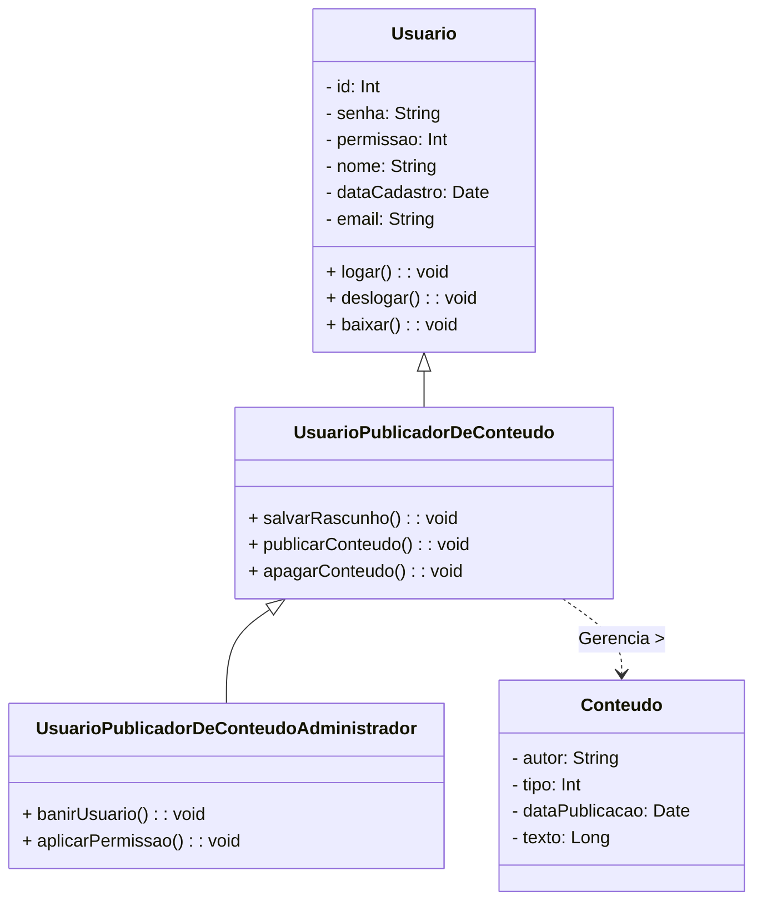

```mermaid
classDiagram
    class Usuario {
        - id: Int
        - senha: String
        - permissao: Int
        - nome: String
        - dataCadastro: Date
        - email: String
        + logar(): void
        + deslogar(): void
        + baixar(): void
    }

    class UsuarioPublicadorDeConteudoAdministrador {
        + banirUsuario(): void
        + aplicarPermissao(): void
    }

    class UsuarioPublicadorDeConteudo {
        + salvarRascunho(): void
        + publicarConteudo(): void
        + apagarConteudo(): void
    }

    class Conteudo {
        - autor: String
        - tipo: Int
        - dataPublicacao: Date
        - texto: Long
    }

    Usuario <|-- UsuarioPublicadorDeConteudo
     UsuarioPublicadorDeConteudo<|-- UsuarioPublicadorDeConteudoAdministrador
     UsuarioPublicadorDeConteudo ..> Conteudo : Gerencia >
```
